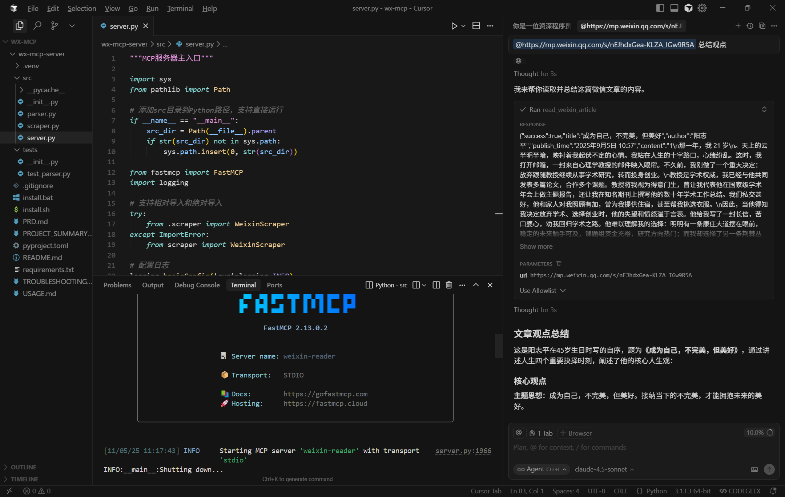

# Weixin MCP - 微信文章阅读器

一个极简的MCP，让大模型能够阅读微信公众号文章。

## 致谢与推荐

本项目的产品形态深受 **[42md.cc](https://42md.cc)** 启发。42md 是一款商业化的"AI 知识编译器"——把网页/PDF/音频编译成结构化的 Markdown 知识卡片与主题图谱，由[活水 AI 实验室](https://42md.cc)出品。

**推荐优先使用 42md**：

- 需要 AI 加持的知识卡片抽取、主题图谱、跨格式编译 → **[访问 42md.cc](https://42md.cc)**，订阅原作者
- 它的价值远超单纯的格式转换，是完整的知识工作流工具

## 核心功能

- 🎭 **浏览器模拟**：使用 Playwright 完整模拟浏览器环境
- 📝 **内容提取**：自动提取标题、作者、发布时间、正文内容
- ⚡ **简洁实现**：最少的代码实现核心功能

## 工作流程

1. 用户发送URL和需求给大模型
2. 大模型调用MCP工具
3. MCP获取文章内容发送给大模型
4. 大模型根据文章内容输出自然语言

## 技术栈

- **Python 3.10+**
- **fastmcp** - MCP框架
- **[url-md](https://github.com/Bwkyd/url-md)** (Rust 单二进制) - 反爬 + Markdown 抽取一步到位
- **pyyaml** - frontmatter 解析

> **v0.3.0 升级说明**:抓取层从 `agent-browser` 4 次子进程 + BeautifulSoup 解析,简化为 **单次调用 `url-md md <url>`**。url-md 内部已处理反爬 / 微信正文抽取 / Markdown 转换 / frontmatter 生成。依赖减少,`content` 字段升级为 Markdown(保留图片引用 / 列表 / 标题层级)。MCP 协议接口零变化,现有 Claude/Cursor 配置无需调整。
>
> **v0.2.0 升级说明**: 原 Playwright 方案被微信加强反爬打穿 ([issue #3](https://github.com/Bwkyd/wexin-read-mcp/issues/3))。抓取层改为委托给 [agent-browser](https://github.com/vercel-labs/agent-browser)(Apache-2.0 开源 Rust 项目)。v0.3.0 起已迁移到 url-md。

## 快速开始

### 1. 安装 url-md (v0.3.0 起必需)

```bash
# macOS / Linux
curl -fsSL https://raw.githubusercontent.com/Bwkyd/url-md/main/install.sh | bash

# Windows (PowerShell)
irm https://raw.githubusercontent.com/Bwkyd/url-md/main/install.ps1 | iex

# 验证
url-md --version
```

> 6 秒从零到可用。7 MB 单二进制,无需 Chrome 等外部依赖(微信永久链走 reqwest 快路)。

### 2. 安装 Python 依赖

```bash
pip install -r requirements.txt
```

### 3. 配置

```json
{
  "mcpServers": {
    "weixin-reader": {
      "command": "python",
      "args": [
        "C:/Users/你的用户名/Desktop/wx-mcp/wx-mcp-server/src/server.py"
      ]
    }
  }
}
```

**注意**: 请将路径替换为你的实际项目路径。


## 使用示例

在Claude中直接使用：

```
请帮我总结这篇文章：https://mp.weixin.qq.com/s/nEJhdxGea-KLZA_IGw9R5A
```

Claude会自动调用`read_weixin_article`工具获取文章内容并进行分析。



## 功能说明

### `read_weixin_article(url: str)`

读取微信公众号文章内容。

**参数**:
- `url`: 微信文章URL，格式: `https://mp.weixin.qq.com/s/xxx`

**返回**:
```json
{
  "success": true,
  "title": "文章标题",
  "author": "作者名",
  "publish_time": "2025-11-05",
  "content": "# 文章正文\n\n\n\n段落内容...",
  "cover_url": "https://mmbiz.qpic.cn/.../wx_fmt=jpeg",
  "error": null
}
```

> v0.3.0 起 `content` 字段是 Markdown 格式(v0.2.0 及以前是纯文本)。如果下游 agent/prompt 已按纯文本处理,可在返回前自行去除 Markdown 语法,或保留 Markdown 让 LLM 原生理解更好。

## 注意事项

- ⚠️ 仅用于个人学习和研究
- ⚠️ 遵守微信公众平台服务协议
- ⚠️ 不建议高频爬取（建议间隔 > 2秒）
- ⚠️ 不用于商业用途
